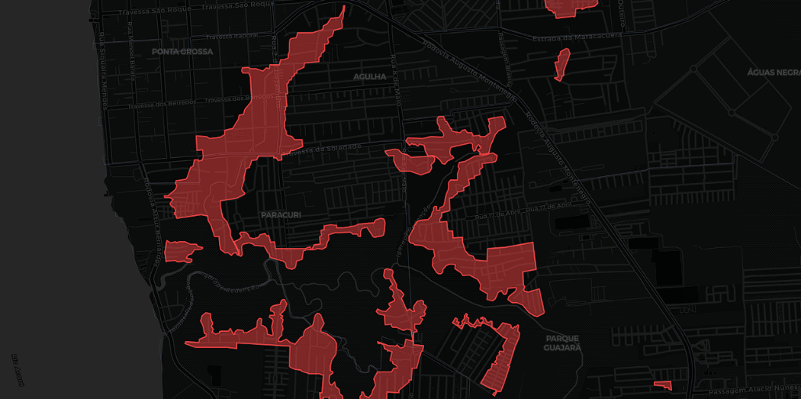

# Belém Geological Risk & Neighborhood Boundary Extractor (GIS)




An end-to-end Geospatial Data Engineering project designed to solve the challenge of extracting, georeferencing, and structuring administrative boundaries and environmental risk vectors from unstructured, official PDF maps. 

The project consolidates two distinct scientific data extraction pipelines and exposes the georeferenced results on an interactive frontend GIS dashboard.

---

## 🔬 Scientific & Engineering Achievements

This repository contains the automation scripts and frontend visualizers for two major geoprocessing tasks:

### 1. Official Neighborhood Boundary Extraction (CODEM)
*   **The Problem:** The official neighborhood borders of Belém/PA are published by **CODEM** (Companhia de Desenvolvimento e Administração da Área Metropolitana de Belém) as single-page PDF maps. These maps lack vector coordinate files (e.g., shapefiles or GeoJSON), making them unusable for GIS dashboards.
*   **The Pipeline (`extract_codem_geometries.py`):**
    *   Scans the PDF elements using **PyMuPDF** to extract the vector drawing paths matching a target color.
    *   Performs **Linear Regression Fitting (`numpy.polyfit`)** on the UTM coordinate grid labels printed on the page edges. This dynamically calculates the translation and scaling functions (X/Y coefficients) between the PDF's point-space and real-world UTM Coordinates (SAD69 / Sirgas2000 UTM 22S - EPSG:31982).
    *   Applies the calculated matrix transformations to convert the boundary vertices and projects them into standard WGS84 (`EPSG:4326`) polygons.
*   **The Merger (`generate_supremo.py`):** Combines the extracted urban neighborhood shapes with background geographical island margins (Mosqueiro, Outeiro, Cotijuba, Combu) to form the unified municipal boundary map (`belem_bairros_supremo.geojson`).

### 2. Geological Risk Area Extraction (CPRM & Defesa Civil)
*   **The Problem:** The Geological Survey of Brazil (**CPRM**), in partnership with **Defesa Civil de Belém**, assessed 125 sectors of geological and environmental risk (floods, tides, coastal erosion, landslips) and published them as 125 "pranchas" (GeoPDF documents). The coordinates of these risk zones were locked inside these files.
*   **The Pipeline (`extract_riscos_geometries.py`):**
    *   Extracts internal GeoPDF dictionary structures (`/VP` - Viewport and `/GPTS` - Geopoint tags) to georeference the vector polygons representing risk boundaries (orange/red paths).
    *   Converts the polygons to WGS84 and maps them spatially onto the official neighborhood boundaries extracted in Task 1.
    *   Mines the raw text stream of the PDFs to extract structured metadata, converting unstructured tables into a clean schema: risk level (Alto/Muito Alto), properties at risk, population at risk, typology, detailed descriptions, technical recommendations, and technical team credits.

---

## 🏢 Institutional Citations & Researcher Credits

The source data used to build these datasets represents high-criticality scientific field research. We credit the following institutions and individuals who authored the physical surveys:

### Publishing Institutions
*   **Defesa Civil de Belém** (Municipal Civil Defense of Belém, PA)
*   **CPRM / Serviço Geológico do Brasil** (Geological Survey of Brazil)
*   **CODEM** (Companhia de Desenvolvimento e Administração da Área Metropolitana de Belém)

### Technical Research Team (CPRM & Defesa Civil)
*   **Sheila Teixeira** (Pesquisadora em Geociências - CPRM)
*   **Homero Reis de Melo Júnior** (Pesquisador em Geociências - CPRM)
*   **Alceu Mendel** & **Alceu Mendel Jr.** (Analistas em Geociências - CPRM)
*   **Dianne Fonseca** (Pesquisadora em Geociências - CPRM)
*   **Djalma Hartery** (Técnico em Geociências - CPRM)
*   **Lenilson Queiroz** (Pesquisador em Geociências - CPRM)
*   **Iris Celeste Nascimento Bandeira** (Pesquisadora em Geociências - CPRM)
*   **Antônio Cunha Neto** (Coordenador Técnico da Defesa Civil de Belém)
*   **Claudionor** (Coordenador da Defesa Civil de Belém)
*   **Janair** & **Daniel Mendonça** (Investigadores da Defesa Civil de Belém)

---

## 📁 Repository Structure

To preserve space and respect copyrights, **the raw source PDFs and heavy generated GeoJSON data files are excluded from this Git repository** (defined in `.gitignore`). Anyone can replicate the dataset locally by running the pipeline from scratch.

```text
/belem-geospatial-risk-mapping
├── /scratch                    # Statically saved site sources for crawling
│   ├── Bairros de Belém – CODEM.html
│   └── view-source_https___defesacivil.belem.pa.gov.br_riscos-geologicos_.mhtml
├── .gitignore                  # Ignores /pdfs, *.geojson, and compiled data *.js
├── download_codem_pdfs.py      # Crawls and downloads neighborhood map PDFs
├── download_riscos_pdfs.py     # Crawls and downloads 125 risk pranchas PDFs
├── extract_codem_geometries.py # Extracts neighborhood coordinates using UTM grid regression
├── extract_riscos_geometries.py# Extracts risk area boundaries using GeoPDF Viewports
├── generate_supremo.py         # Merges neighborhoods and background island boundaries
├── generate_js_data.py         # Compiles parsed GeoJSON data into JS import files
└── index.html                  # Standalone GIS Leaflet dashboard viewer
```

---

## 🚀 Replicating the Dataset

### 1. Prerequisites
Install the required Python environment dependencies:
```bash
pip install pymupdf shapely pyproj numpy beautifulsoup4
```

### 2. Download the Official PDFs
Run the crawler scripts (which read the static pages inside `/scratch` to locate urls and respect server download limits with built-in request intervals):
```bash
# Downloads neighborhood PDFs into pdfs/bairros/
python download_codem_pdfs.py

# Downloads risk PDFs into pdfs/riscos-geologicos/
python download_riscos_pdfs.py
```

### 3. Run the Geoprocessing Pipeline
Execute the extraction scripts sequentially to build the vector geometries:
```bash
# 1. Extract neighborhood borders
python extract_codem_geometries.py

# 2. Merge borders with island limits (requires the reference geojson in parent folder)
python generate_supremo.py

# 3. Extract geological risk zones and structure metadata
python extract_riscos_geometries.py

# 4. Compile the output GeoJSON collections into JS variables
python generate_js_data.py
```

### 4. Open the Dashboard
Once the data is generated, open `index.html` directly in any web browser to view the interactive Leaflet map. You can search neighborhoods, query risk details, and toggle active layers.
