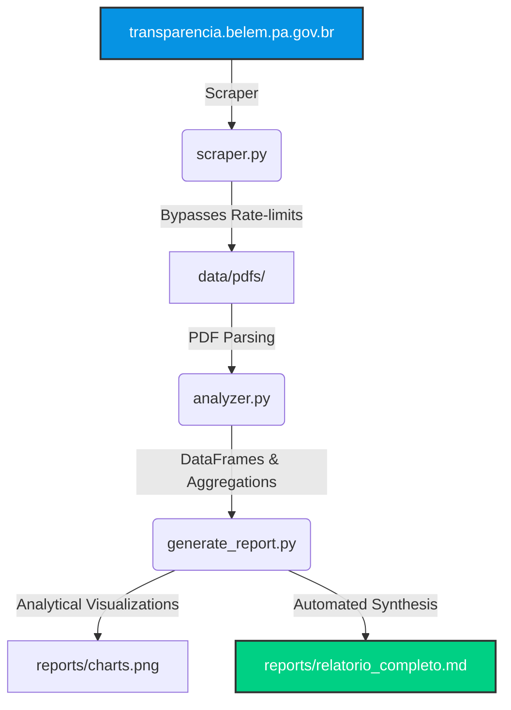

# 📊 GovTech Case: Belém Transparency Analytics
> **Automated scraping, extraction, and analytics of municipal budget performance and public health funding (Belém/PA, Brazil)**

This project contains a production-grade data pipeline written in Python that scrapes the official **Portal da Transparência de Belém**, downloads annual accounting reports (Anexos 8, 9, and 10 of Brazilian Federal Law 4320/64) and monthly consolidated financial sheets (Balancetes), extracts structured tabular data from unstructured PDFs, and compiles analytical insights.

---

## 🏛️ Context & Engineering Challenges

Municipal financial data in Brazil is publicly available on Transparency Portals, but is typically published as raw, nested, and sometimes scanned PDF documents. Performing multi-year longitudinal studies, auditing budget deviations, or analyzing dependencies on federal funding normally requires manual compilation.

This repository demonstrates a **GovTech solution** that automates:
1. **Dynamic Web Scraping:** Scraping the portal's content management system (WordPress uploads) under strict rate-limits, bypassing CORS, and using robust file-caching mechanisms.
2. **Tabular PDF Mining:** Using `pypdf` and layout-aware regex parsers to cleanly extract tables spanning dozens of pages, handling text coordinate shifts and column mergers.
3. **Data Aggregation:** Aligning accounting categories (Receitas Correntes/Capital, Despesas por Função) across distinct fiscal years.
4. **Insight Generation:** Compiling automated markdown summaries and generating comparative visualizations of budget execution.

---

## 🏗️ Pipeline Architecture



---

## 📂 Project Structure

```
belem-transparency-analytics/
├── .gitignore
├── requirements.txt
├── scraper.py           # Web scraper for the Portal da Transparência pages
├── analyzer.py          # PDF table extractor utilizing pypdf
├── generate_report.py   # Aggregator and Markdown/Chart compiler
├── run_pipeline.py      # Entry point to execute the pipeline
└── reports/
    ├── relatorio_completo.md   # The generated analytical report (in PT-BR)
    ├── receitas_historico.png  # Historical revenue deviation chart
    └── despesas_setores_pie.png# 2025 Sector expenses distribution chart
```

---

## 📈 Key Financial Concepts (Lei Federal 4320/64)

To extract and interpret the data accurately, the pipeline mirrors Brazilian public accounting structures:
*   **Anexo 10 (Comparativo da Receita Orçada com a Arrecadada):** Compares the estimated municipal revenue against the actual collected income, highlighting tax compliance and transfer variations.
*   **Anexo 8 (Demonstrativo de Despesas por Funções):** Consolidates municipal spending by sectors/verticals (Saúde, Educação, Saneamento, etc.), classifying expenses into **Despesas Correntes** (operational costs, payroll) and **Despesas de Capital** (infrastructure investments, debt amortization).
*   **Balancetes Financeiros Consolidados:** Monthly cash-flow summaries utilized to track the ongoing fiscal year execution (e.g., 2026).

---

## 🚀 Getting Started

### 1. Installation
Clone the repository and install the dependencies:
```bash
pip install -r requirements.txt
```

### 2. Execution
Run the unified pipeline runner. The scraper will check for cached files in `data/pdfs/` before attempting online queries:
```bash
python run_pipeline.py
```

Check the generated files inside `reports/` to see the outputs.

---

## ✉️ Contact & Context

This project represents the data pipeline engineering used to map municipal revenues and validate compliance for the **[visabelem.net](https://visabelem.net)** digital sanitary surveillance platform.

Developed by **Daniel S. de Jesus**  
*Email:* dpo@visabelem.net
