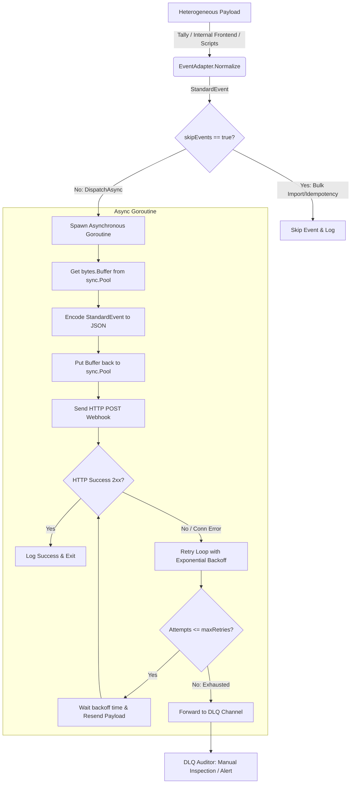

# Go Event Adapter Pattern


A demonstration of Event-Driven Architecture (EDA), Adapter Pattern, and Asynchronous Dispatching in Go.

Extracted from the architectural patterns used in [visabelem.net](https://visabelem.net), where the core Go backend needs to send heterogeneous form submissions to an external orchestrator (n8n) without blocking the HTTP response thread or dealing with volatile email templates.

---

## 📌 The Problem Solved

In a municipal system, data enters the database from multiple sources:
1. Public forms (Tally.so)
2. Internal react dashboards (Frontend)
3. Bulk data migrations (Scripts)

If the Go backend were to format and send emails synchronously for every insert:
- An SMTP timeout would cause the citizen's browser to hang (HTTP 504).
- A bulk migration of 10,000 records would trigger 10,000 emails, blacklisting the municipal IP.
- Changing an email's text would require recompiling and redeploying the Go binary.
## 🗺️ Architecture Workflow



## 🚀 Architecture Highlights

1. **Decoupled Producers:** Form submissions (Tally, Typeform) don't need to know the shape of the internal database structure.
2. **Idempotency Context:** The `skipEvents` parameter demonstrates how to safely pause Webhook triggers during mass-imports or database migrations, preventing accidental email/SMS storms to users.
3. **Resilience & Fault Tolerance:** The `RetryDispatcher` implements **Exponential Backoff**. If a downstream microservice is temporarily down, the adapter slows down retries (`100ms -> 200ms -> 400ms`), preventing accidental DDoS attacks on internal services.
4. **Dead Letter Queue (DLQ):** Messages that exhaust all retries are forwarded to a DLQ channel via `select { case d.DLQ <- evt: }`. This prevents complete data loss and allows manual audits/re-processing.
5. **Garbage Collection Optimization (`sync.Pool`):** The `Dispatcher` natively reuses `bytes.Buffer` instances from a `sync.Pool` during JSON serialization (`json.NewEncoder`). This drastically cuts down heap allocations and prevents GC *Stop-The-World* pauses under high throughput (thousands of events per second).

## 💻 Running the Demo

Zero external dependencies.

```bash
# Run the demo
go run main.go

# Or using the Makefile
make run
```

**Expected Output:**
```text
=== Event-Driven Architecture: Adapter Pattern Demo ===
2026/05/19 18:04:10 [EDA] Event skipped (Idempotency flag active - e.g. Bulk Import)

=== Demo: Asynchronous Retries & Dead-Letter Queue (DLQ) ===
2026/05/19 18:04:10 [EDA] Successfully dispatched event req_tally_001 to http://127.0.0.1:64630
2026/05/19 18:04:10 [EDA] Successfully dispatched event rec_internal_002 to http://127.0.0.1:64630
2026/05/19 18:04:10 [EDA-Retry] Attempt 1 failed for event req_failed_004. Retrying in 100ms. Error: unexpected status code: 500
2026/05/19 18:04:11 [EDA-Retry] Attempt 2 failed for event req_failed_004. Retrying in 200ms. Error: unexpected status code: 500
2026/05/19 18:04:11 [EDA-Retry] All attempts failed for event req_failed_004. Sending to DLQ. Error: unexpected status code: 500
[DLQ Audit] Caught failed event in DLQ!
 - ID: req_failed_004
 - Failed Attempts: 3
 - Last Error: unexpected status code: 500
=== End of Demo ===
```

## 🛠️ Resiliency and Fault Tolerance (Robustness patterns)

The evolved `RetryDispatcher` adds two standard distributed systems design patterns:
1. **Exponential Backoff:** When a webhook destination (e.g. n8n or an external payment queue) returns a transient error (5xx or connection timeout), the system retries with increasing delay (e.g., `100ms * 2^(attempt-1)`). This avoids flooding a struggling server with immediate retries (thundering herd problem).
2. **Dead-Letter Queue (DLQ):** Permanent failures (after maximum retries) are offloaded to a buffered queue channel (`DLQ`) for manual inspection or secondary archiving (e.g., logging to database or raising a PagerDuty alert), rather than simply dropping the event or blocking the system.

---

## 📊 Performance Benchmarks

To verify the optimization claims regarding Garbage Collector pressure reduction, you can run the benchmark suite:

```bash
# Run encoding benchmarks
go test -bench=Benchmark -benchmem -run=^$
```

### Benchmark Results (Intel(R) Core(TM) i3-10100F CPU @ 3.60GHz, Windows):

```text
BenchmarkEncodeWithPool-8      	 1478146	       800.5 ns/op	     208 B/op	       6 allocs/op
BenchmarkEncodeWithoutPool-8   	 1319904	       964.5 ns/op	     400 B/op	       8 allocs/op
```

### Production-Grade Performance Analysis:

Under high concurrency (thousands of requests per second), the **~50% memory allocation reduction** and the **~17% speedup** obtained by utilizing `sync.Pool` translate directly to infrastructure stability:

1. **Garbage Collection (GC) CPU Cycles Reduction:**
   Go's concurrent mark-and-sweep GC triggers based on heap growth (defaulting to double the heap size, controlled by `GOGC`). At **10,000 requests/sec**, allocating a transient `bytes.Buffer` per request without pooling generates **4 MB of garbage/sec** solely for JSON encoding. Dropping this to **2.08 MB/sec** cuts the GC cycle frequency in half. Because the marking phase of the Go GC consumes up to **25% of available CPU cores**, running the GC less frequently frees up substantial processing power to handle incoming HTTP connections.

2. **Tail Latency (P99 & P99.9) Stabilization:**
   When the Go GC executes, it incurs microscopic pauses (*Stop-The-World* phases) to start and finish the marking phases. Under heavy traffic, transient allocations lead to severe GC scheduling churn, creating random latency spikes (e.g., a median latency of 5ms but a P99 spiking to 150ms). Reusing buffers keeps the allocation curve flat, keeping tail latencies predictable.

3. **Memory Allocator Overhead & RSS Preservation:**
   Continually allocating and deallocating small, short-lived buffers forces the Go memory allocator (`mcache`/`mspan`) to continuously slice memory chunks, potentially leading to heap fragmentation and a rising RSS (Resident Set Size). The `sync.Pool` maintains a hot cache of buffers, keeping the memory footprint of the container/VPS extremely stable under sudden traffic bursts.

4. **Lock-Free Concurrency Scaling:**
   Instead of using a channel or mutex-guarded cache (which would introduce severe thread contention and CPU bottlenecks under high loads), `sync.Pool` is internally optimized by the Go runtime to maintain lock-free, thread-local caches mapped directly to each **logical processor (P)**. This ensures that concurrent goroutines retrieve and return buffers without global synchronization overhead, scaling linearly with the CPU core count.


