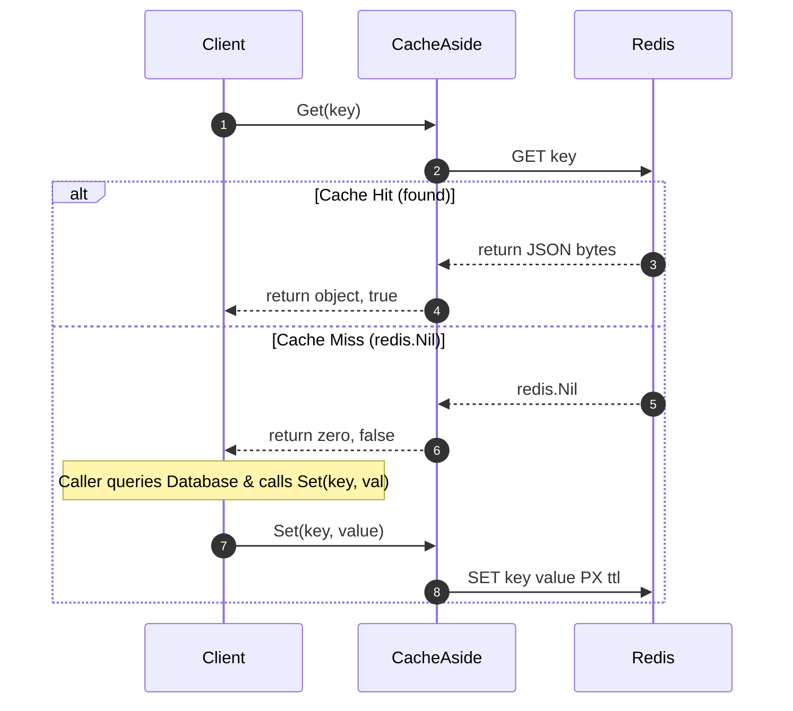

# Go Redis Cache Patterns


A production-ready implementation of common caching and locking patterns in Go using Redis.

This repository demonstrates the practical application of system design principles to handle heavy read loads and distribute race-prone tasks (like batch updates or municipal ticket distribution) in a microservices or distributed environment.

---

## 📌 Architectural Context & The CAP Theorem

When scaling a high-throughput system like [visabelem.net](https://visabelem.net), database choice and caching layers require a careful trade-off balancing **Consistency**, **Availability**, and **Partition Tolerance** (CAP Theorem).

```
                      Consistency (C)
                            /\
                           /  \
                          /    \
                         /  CA  \
                        /________\
                       /          \
                      /  RDBMS     \
                     /    (Postgres)\
                    /                \
     Availability  /__________________\ Partition Tolerance
         (A)             CP     AP         (P)
                    (Redis)   (DynamoDB)
```

| Technology | CAP Classification | Write Latency | Read Latency | Primary Use Case |
|---|---|---|---|---|
| **SQLite** | **CA** (Single Node) | Low (Write-Ahead Log) | Microseconds | Local state, microservices with low-concurrency, single-replica setups. |
| **PostgreSQL** | **CP** (Configurable) | Moderate (~10ms) | ~1-5ms | Source of truth, ACID transactions, complex relational data. |
| **Redis** | **AP** (Asynchronous Replication) | <1ms | <1ms | Ephemeral cache layer, distributed locks, rate-limiting, and queues. |

> *Note on AP and Durability in Production:* The AP classification above describes Redis in its default configuration (asynchronous replication, no persistence). In production at visabelem.net, Redis is used not only as an ephemeral cache but also as an event queue for SIAT retry jobs. For those queues, Redis is configured with **AOF persistence** (`appendfsync everysec`) to bound maximum data loss to 1 second under server crash, shifting Redis closer to a CP position for the queuing use case while retaining AP characteristics for the cache layer.

### Caching vs. Relational Integrity
By adding a **Cache-Aside** layer on top of PostgreSQL/SQLite, we sacrifice immediate strict consistency across all read replicas (eventual consistency) in exchange for sub-millisecond read response times and reduced database CPU load.

---

## 🚀 Patterns Implemented

### 1. Cache-Aside (Lazy Loading)
The application attempts to read from Redis first. If it's a **miss**, it falls back to the database, reads the data, writes it to Redis, and returns the value.



#### Key Features:
- **Resilience:** If Redis is down, the cache layer returns a silent miss. The application safely falls back to the database, ensuring **high availability**.
- **Generics-Based:** Built using Go generics (`[T any]`) for type-safe JSON serialization.

---

### 2. Distributed Lock with Lua Script
In distributed microservices, duplicate scheduled cron jobs or concurrent webhooks can trigger race conditions (e.g., trying to generate the same municipal report twice). A **Distributed Lock** ensures only one worker executes a critical section.

#### The Lock Leak / Theft Problem:
If **Worker A** acquires a lock, hangs (due to a long GC pause), the lock expires. **Worker B** acquires the lock. **Worker A** wakes up and calls `UNLOCK`. Without ownership validation, Worker A will delete Worker B's lock, leaving the resource unprotected.

#### The Solution: Atomic Lua script
By using a unique `ownerID` (e.g., UUID) and releasing the lock via a **Lua Script** executed atomically inside Redis, we guarantee a client can only delete its own lock.

```lua
-- Atomic Lock Release
if redis.call("get", KEYS[1]) == ARGV[1] then
    return redis.call("del", KEYS[1])
else
    return 0
end
```

---

## 💻 Running Tests

The tests run in-memory using `miniredis` (an embedded Redis server wrapper), eliminating the need for Docker or local Redis installations.

```bash
# Run unit tests
go test -v ./...
```

**Expected Output:**
```text
=== RUN   TestCacheAside
--- PASS: TestCacheAside (0.52s)
=== RUN   TestDistributedLock
--- PASS: TestDistributedLock (0.52s)
=== RUN   TestDistributedLock_Timeout
--- PASS: TestDistributedLock_Timeout (0.00s)
PASS
ok  	github.com/0jsDanny/go-redis-cache-patterns/cache	0.519s
ok  	github.com/0jsDanny/go-redis-cache-patterns/lock	0.522s
```

---

## ⚖️ Design Trade-offs & Alternatives

Choosing a caching or locking strategy requires weighing different trade-offs:

### 1. Cache-Aside vs. Write-Through Caching
* **Why Cache-Aside?** Cache-Aside decouples the caching layer from database drivers. If the Redis cluster crashes, the application experiences a performance degradation (all reads hit the DB), but it **remains fully functional (graceful degradation)**. In contrast, *Write-Through* requires writing to both Redis and the DB synchronously; if the cache fails, the write transaction fails, violating availability.
* **The Cost:** Cache-Aside introduces the risk of **stale data** if a record is updated in the database but the corresponding cache key is not invalidated. To mitigate this in production, set a reasonable Time-To-Live (TTL) on all keys and perform explicit cache eviction on updates.

### 2. Redis Distributed Lock vs. Alternatives
When coordinating concurrent tasks across instances, we choose Redis Lua locks over other mechanisms:

| Locking Mechanism | Pros | Cons | Why Reject for Scale? |
|---|---|---|---|
| **Go `sync.Mutex`** | Ultra-fast (nanoseconds), zero network overhead. | Works **only** within a single OS process/binary. | Cannot coordinate across replicas behind a load balancer. |
| **RDBMS Row Locking** (`SELECT FOR UPDATE`) | Strict transactional consistency (ACID). | Holds database connections open. High database CPU overhead. | Under high concurrency, holding transactions open causes **connection pool exhaustion** and latency amplification in the main DB. |
| **Redis Distributed Lock (Lua)** | Sub-millisecond latency, non-blocking lock acquisition, centralized state. | Eventual consistency in Redis replication (requires Redlock for multi-master safety). | Ideal for transient/idempotent locks (e.g. rate-limiting, double-submit protection) where absolute strict consistency is secondary to high availability. |

