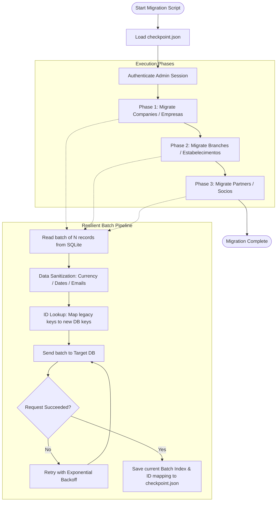

# Node.js ETL & Data Migration Scripts


A curated collection of production-grade Node.js scripts used for Data Engineering, ETL (Extract, Transform, Load) pipelines, and database migrations in [visabelem.net](https://visabelem.net).

These scripts demonstrate how to handle massive amounts of real-world legacy data, ensuring referential integrity, crash resilience, and high performance when moving data between systems (e.g., from SQLite/PostgreSQL to PocketBase).

---

## 🗺️ Migration Pipeline Architecture



## 🛠️ Highlights

### 1. `migrate-cnpj-data.js`
A highly resilient data migration script designed to move thousands of complex business records (Empresas, Estabelecimentos, and Socios) from a legacy SQLite dump into a modern RESTful API (PocketBase). 

**Key Engineering Features:**
*   **Checkpointing & Resumability:** Uses a `CheckpointManager` to save the exact batch index and mapped IDs to a JSON file. If the migration crashes on record 10,000, it resumes exactly from there without duplicating data or losing foreign keys.
*   **Phase-Based Execution:** Enforces referential integrity by strictly running sequentially: Phase 1 (Companies) → Phase 2 (Branches) → Phase 3 (Partners).
*   **Exponential Backoff Retry:** The `executeBatch` function automatically retries failed network requests to the database, ensuring intermittent network issues don't kill a 3-hour migration.
*   **Aggressive Data Sanitization:** Real-world data is messy. Includes robust parsers for Brazilian currency (`parseCapitalSocial`), dates (`parseDate`), and a strict regex filter to silently drop invalid email addresses (`cleanEmail`) without halting the pipeline.

### 2. `populate-optimized-cache.js`
A data consolidation and cache-warming script. Municipal dashboards need to display metrics spanning from 2018 to the present day. Querying this across multiple historical and modern tables simultaneously would cripple the database.

**Key Engineering Features:**
*   **Multi-Source Normalization:** Aggregates data from 4 distinct tables (legacy history, legacy fees, modern triages, modern fees).
*   **Heuristic Fallbacks:** The `normalizeType` function uses prioritized keywords to standardize dozens of free-text category inputs created by civil servants over 7 years into 10 unified BI categories.
*   **Payload Introspection:** Extracts accurate historical dates deeply nested inside JSON payloads for records that were already migrated previously (avoiding the "everything happened today" timestamp bug).
*   **Batch Operations:** Deletes stale cache entries and inserts the newly calculated aggregated records in batches to optimize database IOPS.

---

## 🚀 Running

These scripts are provided as code examples of structural and architectural thinking. They require the actual `.db` files to be present, and utilize environment variables for database authentication.

```bash
# Configure credentials via environment variables (never hardcode credentials)
export PB_ADMIN_EMAIL="admin@yourinstance.com"
export PB_ADMIN_PASSWORD="$(cat ~/.secrets/pb_password)"

# Example dry-run execution (simulates the migration without committing to the DB)
node migrate-cnpj-data.js --dry-run

# Force clear checkpoint and start over
node migrate-cnpj-data.js --reset
```
