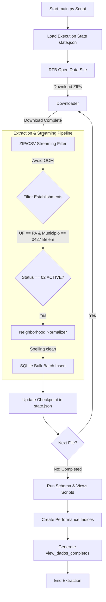

# CNPJ Belém Migration - Active Businesses


This project downloads public CNPJ datasets from the Brazilian Federal Revenue (Receita Federal), filtering solely for **ACTIVE businesses located in Belém/PA**.

## 🗺️ Pipeline Workflow (ETL)



## Data Source
- **Official Share (Nextcloud)**: `https://arquivos.receitafederal.gov.br/index.php/s/<SHARE_TOKEN>`
- **Official Portal**: https://www.gov.br/receitafederal/dados-abertos-dos-cnpj
- **Dynamic Resolution**: The pipeline uses WebDAV (`PROPFIND`) queries on the Nextcloud public API to dynamically find and download from the latest monthly snapshot folder (e.g., `2026-05/`).

### Configuration
To run the miner, you must provide the Nextcloud share token (`<SHARE_TOKEN>`). You can do this in three ways:
1. **Interactive Prompt**: Run the script, and it will prompt you to enter the token.
2. **Environment Variable**: Set the `RECEITA_SHARE_TOKEN` environment variable.
3. **Local `.env` File**: Create a `.env` file in the root of the project with:
   ```env
   RECEITA_SHARE_TOKEN=your_token_here
   ```


## How to Run
```bash
python main.py
```

## Database Schema (SQLite)

### Main Tables

#### `estabelecimentos` (Branches / Locations)
| Column | Type | Description |
|--------|------|-------------|
| cnpj_basico | TEXT | First 8 digits of the CNPJ (PK) |
| cnpj_ordem | TEXT | Order digits (0001 = headquarters) (PK) |
| cnpj_dv | TEXT | Verification digits (PK) |
| matriz_filial | TEXT | 1=Headquarters, 2=Branch |
| nome_fantasia | TEXT | Trade name |
| situacao_cadastral | TEXT | 02=Active (filtered) |
| data_situacao_cadastral | TEXT | Status date (YYYYMMDD) |
| motivo_situacao_cadastral | TEXT | Motive code |
| nome_cidade_exterior | TEXT | City abroad (if applicable) |
| pais | TEXT | Country code |
| data_inicio_atividade | TEXT | Operation start date (YYYYMMDD) |
| cnae_fiscal_principal | TEXT | Primary CNAE activity code (7 digits) |
| cnae_fiscal_secundaria | TEXT | Secondary CNAE activity codes (comma-separated) |
| tipo_logradouro | TEXT | Street type (Rua, Av, etc.) |
| logradouro | TEXT | Street name |
| numero | TEXT | Number |
| complemento | TEXT | Address complement |
| bairro | TEXT | Neighborhood |
| cep | TEXT | Postal/ZIP code (8 digits) |
| uf | TEXT | State (PA) |
| municipio | TEXT | Municipality code (0427=Belém) |
| ddd_1 | TEXT | Area code phone 1 |
| telefone_1 | TEXT | Phone number 1 |
| ddd_2 | TEXT | Area code phone 2 |
| telefone_2 | TEXT | Phone number 2 |
| ddd_fax | TEXT | Area code fax |
| fax | TEXT | Fax number |
| correio_eletronico | TEXT | E-mail address |
| situacao_especial | TEXT | Special registration status |
| data_situacao_especial | TEXT | Special registration status date |
| bairro_normalizado | TEXT | Normalized neighborhood name (cleaned by normalizer) |

#### `empresas` (Companies)
| Column | Type | Description |
|--------|------|-------------|
| cnpj_basico | TEXT | First 8 digits of CNPJ (PK) |
| razao_social | TEXT | Legal business name |
| natureza_juridica | TEXT | Legal nature code |
| qualificacao_responsavel | TEXT | Responsible manager qualification code |
| capital_social | TEXT | Capital stock (in cents) |
| porte_empresa | TEXT | Company size code (01=ME, 03=EPP, 05=Others) |
| ente_federativo_responsavel | TEXT | Responsible federative entity |

#### `socios` (Partners / Stakeholders)
| Column | Type | Description |
|--------|------|-------------|
| cnpj_basico | TEXT | First 8 digits of CNPJ |
| identificador_socio | TEXT | Partner type (1=PJ, 2=PF, 3=Foreigner) |
| nome_socio_razao_social | TEXT | Partner name / Legal entity name |
| cnpj_cpf_socio | TEXT | CPF/CNPJ of the partner |
| qualificacao_socio | TEXT | Qualification code |
| data_entrada_sociedade | TEXT | Registry entry date (YYYYMMDD) |
| pais | TEXT | Country code |
| representante_legal | TEXT | Representative CPF |
| nome_representante | TEXT | Representative name |
| qualificacao_representante_legal | TEXT | Representative qualification code |
| faixa_etaria | TEXT | Age range code |

#### `simples_mei` (Tax Regime / MEI) ⭐
| Column | Type | Description |
|--------|------|-------------|
| cnpj_basico | TEXT | First 8 digits of CNPJ (PK) |
| opcao_pelo_simples | TEXT | Simple Tax Regime option (S/N) |
| data_opcao_simples | TEXT | Simple Tax Regime option date |
| data_exclusao_simples | TEXT | Simple Tax Regime exclusion date |
| opcao_pelo_mei | TEXT | **MEI tax option (S/N)** |
| data_opcao_mei | TEXT | MEI option date |
| data_exclusao_mei | TEXT | MEI exclusion date (empty = active) |

### Lookup Reference Tables

| Table | Description |
|-------|-------------|
| `cnaes` | Economic activity codes and descriptions |
| `naturezas` | Legal entity structures |
| `municipios` | Municipalities |
| `motivos` | Motives of registration status |
| `paises` | Countries |
| `qualificacoes` | Partner qualifications |

### Primary View

#### `view_dados_completos`
Joins all tables with resolved lookup translations:

| Calculated Field | Description |
|-------------------|-------------|
| desc_situacao_cadastral | ACTIVE, CANCELLED, etc. |
| desc_natureza_juridica | Legal structure description |
| desc_cnae | Activity code description |
| desc_porte | MICRO COMPANY, EPP, etc. |
| desc_municipio | Municipality name |
| **eh_mei_ativo** | **1 if active MEI, 0 otherwise** |

## Useful Queries

### List all active MEIs (Microentrepreneurs)
```sql
SELECT cnpj_basico, nome_fantasia, razao_social, desc_cnae
FROM view_dados_completos
WHERE eh_mei_ativo = 1;
```

### Count businesses by company size
```sql
SELECT desc_porte, COUNT(*) as total
FROM view_dados_completos
GROUP BY desc_porte;
```

### Active businesses count by neighborhood
```sql
SELECT bairro, COUNT(*) as total
FROM view_dados_completos
GROUP BY bairro
ORDER BY total DESC;
```

---

## 🔒 Data Protection & Compliance (LGPD)

The data processed by this pipeline is extracted directly from the official Open Data portal of the Brazilian Federal Revenue (Receita Federal do Brasil) under the terms of open data licenses for governmental and commercial use, constituting a public database of public interest (art. 7, II and VIII of LGPD — Law 13.709/2018).

However, the database contains personal data belonging to natural persons (such as registration data of partners/MEIs and legal representatives). If this project is integrated into production workloads or enterprise systems, it is recommended to:
1. **Data Minimization:** Select only the columns strictly necessary for your business logic, discarding partner/representative registration details if not required.
2. **Masking & Encryption:** Mask sensitive values like CPFs (`***.999.999-**`), phone numbers, and e-mails in frontend interfaces, and restrict access to these fields using transit and at-rest encryption or hashing.
3. **Access Control:** Enforce detailed audit logs and Role-Based Access Control (RBAC) on tables containing CPFs and enterprise association data.
