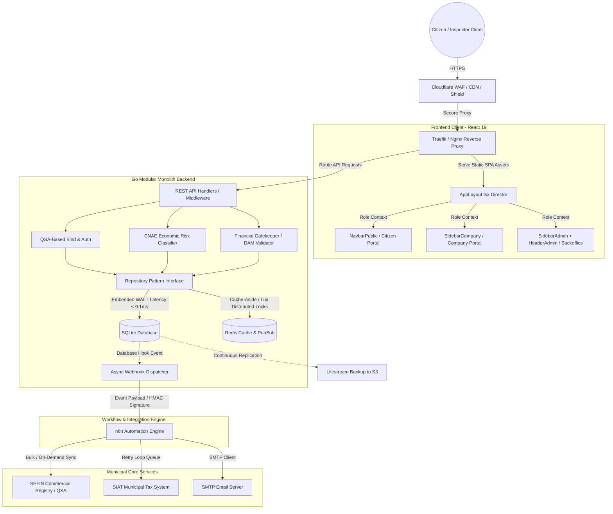

# 🛡️ VisaBelém Interactive Prototype


An interactive, high-fidelity frontend prototype designed to simulate and validate the user experience (UX) flows of the new Sanitary Surveillance Management System for the City of Belém, PA, Brazil. 

This repository acts as a stakeholder alignment workspace and frontend engineering showcase, demonstrating smooth transitions, complex multi-role workflows, and responsive backoffice dashboard interfaces.

---

## 🏗️ Architectural Overview

The prototype is built on top of a highly responsive, client-side routing model that simulates a real-world multi-portal system. The architecture centers around role-based view swapping and dynamic layouts.

### Key Technical Patterns
1. **Dynamic Role-Based Stacking:** Uses a centralized `ModeContext` to manage the active user role (`public`, `company`, or `admin`). Swapping the role dynamically transforms the layout, sidebar menus, and header controls instantly.
2. **Dynamic Nested Layouts:** Structured inside [AppLayout.tsx](file:///src/components/layout/AppLayout.tsx) which acts as a layout director. It splits routing paths into independent, role-specific wrappers:
   * **Public Portal:** Navigated using [NavbarPublic.tsx](file:///src/components/layout/NavbarPublic.tsx).
   * **Company Workspace:** Uses [SidebarCompany.tsx](file:///src/components/layout/SidebarCompany.tsx) with a multi-unit CNPJ switcher.
   * **Administrative Backoffice:** Uses [SidebarAdmin.tsx](file:///src/components/layout/SidebarAdmin.tsx) and [HeaderAdmin.tsx](file:///src/components/layout/HeaderAdmin.tsx), featuring collapsable multi-nested submenu navigations.
3. **Advanced CSS 3D Layering:** The primary metrics widget implements a Neo-Brutalist 3D card layout using pure CSS transforms (`perspective`, `rotate3d`, and layers of `translate3d(0, 0, Z)`). It operates with complete `overflow: visible` safety to prevent perspective clipping.
4. **Declarative Component Animations:** Utilizes `framer-motion` for declarative page entries, progressive step wizards, and list animations.

---

## 🗺️ System Architecture Map

To transition from this frontend prototype to a production environment, the frontend integrates with a resilient, high-performance Go-based modular monolith backend. The Mermaid diagram below outlines the system design decisions (boundaries, caching, persistence, and external workflows):



### Key Engineering & Database Rationale
* **Embedded SQLite in WAL Mode:** Runs directly within the Go process memory space, eliminating network serialization overhead and yielding sub-millisecond query times. Backups are streamed continuously to S3 via Litestream. If transaction volume ever exceeds SQLite's threshold (~10k writes/sec), CGO driver interfaces allow seamless hot-swapping to an external **PostgreSQL** instance.
* **Decoupled Workflow Decoupling (n8n & Webhooks):** Core database transactions are handled instantly by the Go API. Heavy or volatile workflows (like building HTML email attachments, retrying requests to unstable external tax systems like SIAT, or scraping data) are handled asynchronously by sending an HMAC-signed webhook from Go to n8n, preventing thread pool blocks.
* **Caching & Locking (Redis):** A Redis instance manages session state, caches municipal registry responses using a type-safe Cache-Aside pattern, and coordinates concurrent writes using atomic distributed locks via Lua scripts.
* **QSA Partner Binding:** The authentication layer matches the user's login CPF with the SEFIN registry's QSA (Quadro de Sócios e Administradores) to automatically fetch associated company CNPJs without manual user entry.

---

## 🚀 Technical Stack & Libraries

* **Core Framework:** React 19 & TypeScript (strict type check enabled).
* **Build Tooling:** Vite (utilizing HMR and optimized production asset minification).
* **Styling Engine:** TailwindCSS v3 (providing utilities for fluid responsive grids and theme design tokens).
* **Animations:** Framer Motion (for modal transitions, tab swaps, and step indicator layouts).
* **Charts:** Recharts (responsive vector graphs simulating municipal productivity trends).
* **Icons:** Lucide React (standardized SVG iconography).

---

## 📦 Local Installation & Setup

Ensure you have [Node.js](https://nodejs.org/) installed on your machine.

1. **Clone the Repository & Navigate to Folder:**
   ```bash
   cd visabelem-mock
   ```

2. **Install Dependencies:**
   ```bash
   npm install
   ```

3. **Start Local Development Server (Vite HMR):**
   ```bash
   npm run dev
   ```

4. **Build and Minify for Production:**
   ```bash
   npm run build
   ```

---

## 🔒 Privacy & LGPD Compliance Disclaimer

This interactive prototype is built strictly for user experience (UX) validation and presentation purposes. In compliance with the Brazilian General Data Protection Law (LGPD - Lei nº 13.709/2018):
- **Synthetic Data Only:** All personal names, corporate details, CPFs, CNPJs, and financial values rendered or simulated in this application are 100% synthetic mock data.
- **No Real PII:** No real Personally Identifiable Information (PII) from municipal servers or citizens is collected, stored, or processed.
- **Isolation:** The application does not connect to any production municipal databases or live public systems.
